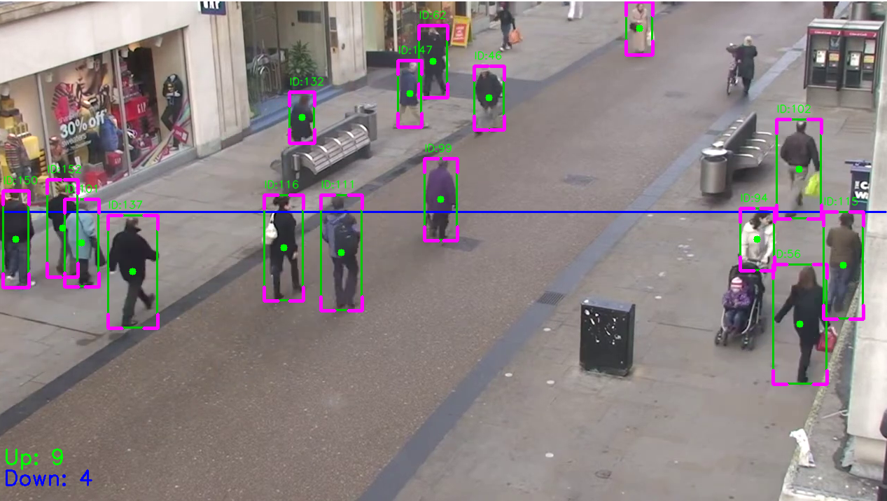
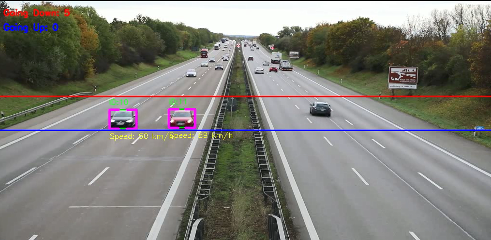

DeepSort

### Install

```
conda create --name PyTorch python=3.8.12
conda remove --name PyTorch --all
conda clean --all

conda install pytorch torchvision torchaudio cudatoolkit=10.2 -c pytorch-lts
pip install ultralytics
```

### Run

1. **Counting people **:
   - Tracks objects using DeepSORT to assign unique IDs
   - Counts the number of people crossing a single line in up or down directions.
   - 

1. **Speed Calculation **:
   - Tracks objects using DeepSORT to assign unique IDs
   -  Calculates the speed of objects crossing two lines..
   - 

### Result

* Check `./runs/` folder

### Demo data
* https://youtu.be/rfkGy6dwWJ(counting people)
* data/highway.mp4(speed calculation)

#### Reference

* https://github.com/Matskevichivan/Counting-People
* https://github.com/MuhammadMoinFaisal/YOLOv8-DeepSORT-Object-Tracking
